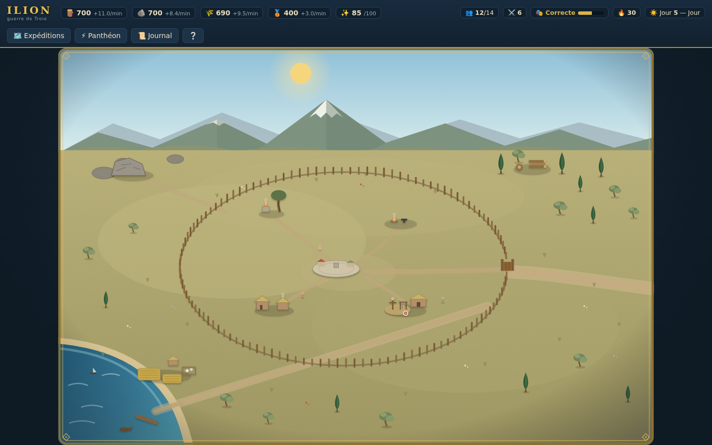
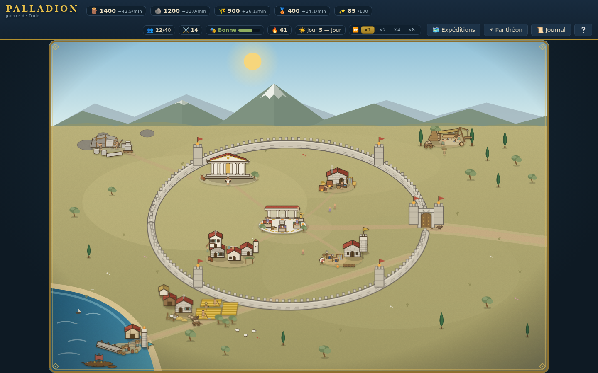
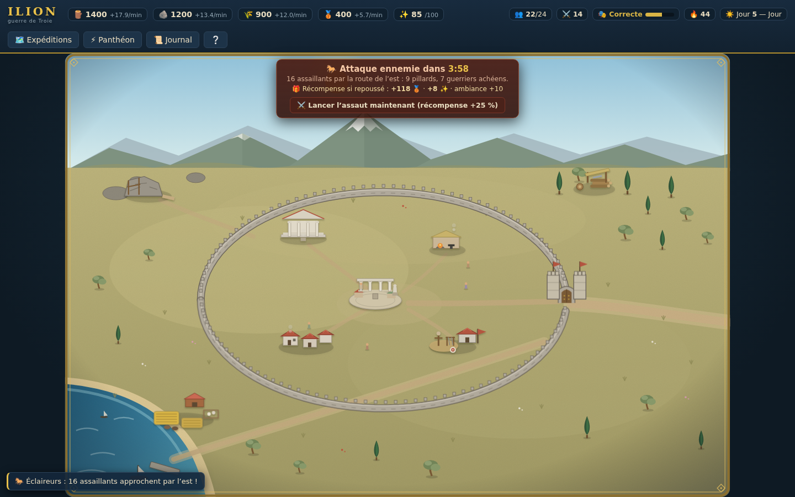
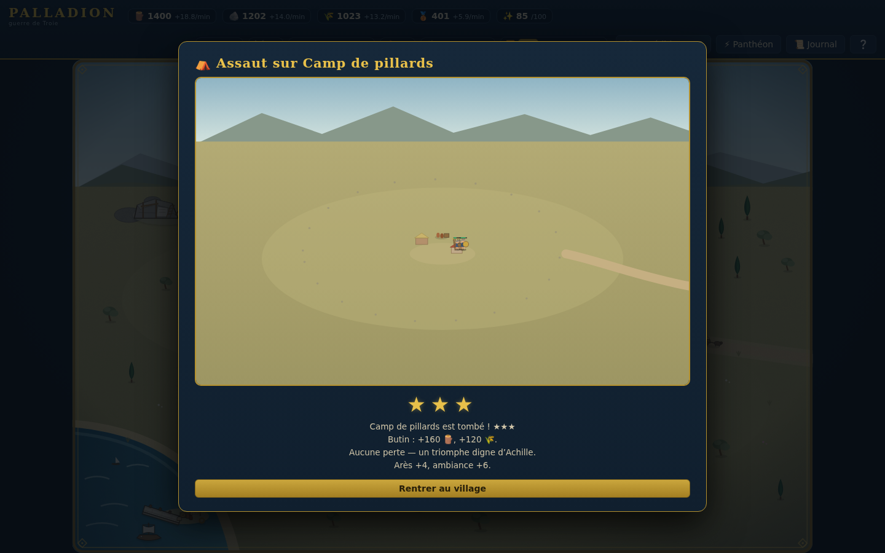
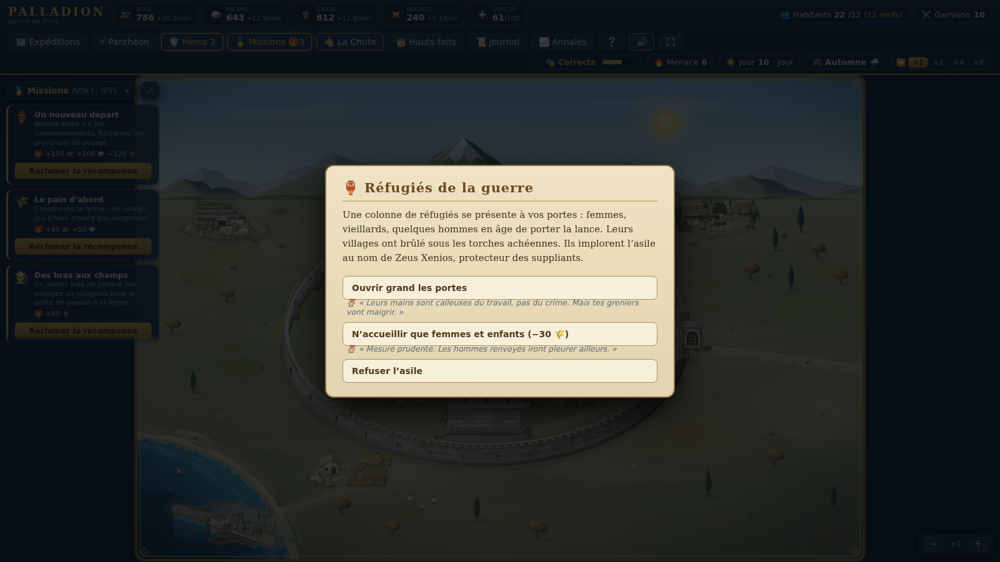
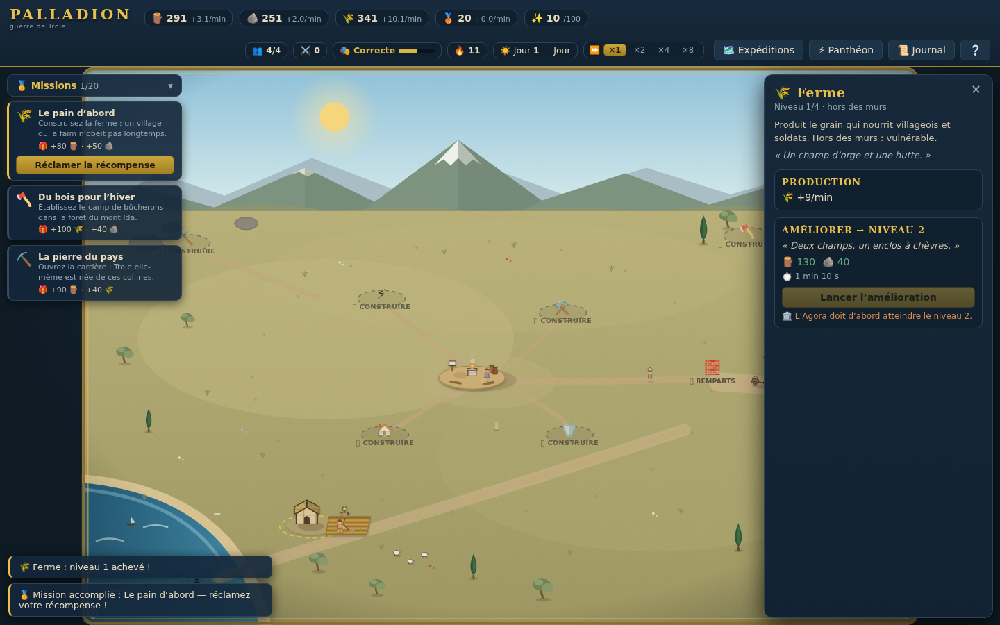

# 🏛️ PALLADION — Chroniques de la guerre de Troie

> Le *Palladion* : la statue d'Athéna tombée du ciel — tant qu'elle se tient dans la cité,
> Troie ne peut pas tomber. Un talisman divin qui conditionne la survie de la ville :
> exactement le pari de ce jeu, où votre relation aux dieux décide de votre résistance
> aux assauts.
>
> Jeu de gestion de village en solo, à l'époque de la guerre de Troie. Bâtissez, défendez,
> honorez les dieux — et regardez votre village **changer réellement d'apparence** à chaque
> amélioration.

**100 % front-end** (React + TypeScript + SVG), sauvegarde locale, déployable sur GitHub Pages.

| Du hameau… | …à la cité fortifiée |
| --- | --- |
|  |  |

## ✨ Ce qui rend PALLADION différent

### 🧱 Une évolution **visuelle** des bâtiments
Chaque bâtiment est dessiné **en SVG par code**, en volumes texturés (tuiles, pierre,
chaume, sillons) avec une apparence distincte par niveau. Les remparts passent de la
palissade de pieux → au muret de pierre sèche → à la muraille crénelée → aux hautes
murailles « bâties par Poséidon » avec tours de guet et étendards. Idem pour les 9 autres
bâtiments (temple, agora, forge, port…). Les dégâts se voient : fissures, décombres,
brèche à la porte. Et le village **vit** : villageois qui flânent, char à bœufs sur la
route, chèvres à la ferme, moutons au pré, fumées et braseros.

### ⚔️ Des vagues d'assaut PvE, jouées sous vos yeux
La prospérité attire les convoitises : des bandes armées (pillards, guerriers achéens,
mercenaires, béliers de siège) attaquent régulièrement. **« Attaque ennemie dans 5 min »** :
les éclaireurs annoncent la composition de la vague **et la récompense promise** si vous
tenez (bronze, faveur, ambiance). Les impatients peuvent **lancer l'assaut immédiatement
pour +25 % de butin**. Puis la bataille se joue **en direct sur la carte** : marche
d'approche, siège des remparts, tirs des archers depuis les murs, brèche, mêlée au cœur
du village… Et pendant l'assaut, vous pouvez invoquer les dieux.



### 🗺️ Mode campagne : à votre tour de piller
8 places fortes de la Troade à mettre à sac, du simple camp de pillards à la forteresse
mysienne : choisissez vos troupes (20 max), regardez l'assaut se jouer sur la carte du
village ennemi — leurs murs, leurs archers, leur garnison — et raflez le butin. Score en
**étoiles** façon classique : ★★★ à moins de 20 % de pertes. Les dieux répondent aussi
pendant vos raids, et la retraite reste toujours possible pour sauver vos vétérans.



### ⚡ Les Olympiens, alliés et juges
- **Zeus** — la foudre s'abat sur les assaillants ; mais sa loi de l'hospitalité (*xenia*)
  punit qui ferme sa porte aux suppliants.
- **Poséidon** — ressoude les pierres de vos remparts… ou les ébranle d'un séisme si vous l'offensez.
- **Athéna** — bouclier stratège en bataille ; si elle vous fait confiance (relation ≥ 25),
  **elle murmure la vérité cachée des dilemmes**.
- **Arès** — fureur au combat, recrues accélérées ; capricieux et vindicatif.

Chaque dieu a une **relation** (−100 à +100) façonnée par vos choix. Un dieu bafoué finit
toujours par se venger.

### 🏺 Des dilemmes moraux à conséquences
Des réfugiés qui implorent l'asile (sincères… ou pillards infiltrés), Zeus déguisé en
mendiant, un cheval de bois abandonné devant vos portes (*« Je crains les Grecs, même
porteurs de présents ! »*), l'émissaire d'Hector qui réclame des lances… Certaines issues
sont **différées** : les traîtres frappent à la nuit tombée.



### 🏅 Vingt missions comme fil rouge
Toujours un objectif à l'écran, toujours une récompense à la clé : des provisions du
premier jour jusqu'à la « Cité de légende », vingt missions guident la partie — bâtir,
recruter, repousser un assaut, réussir un raid trois étoiles, gagner la confiance d'un
dieu… Chaque réclamation finance l'étape suivante : pas de temps mort.



### 🎭 L'ambiance du village
Fêtes, victoires et greniers pleins exaltent le village (production accrue). Famine,
défaites et choix cruels le minent. Sous 25 : **mutinerie** — ouvrez les greniers, promettez
(et tenez parole !), ou réprimez dans le sang. À 0, vos soldats désertent.

### 🌙 Le temps continue sans vous — et s'accélère à la demande
Jeu en temps réel avec cycle jour/nuit. Onglet fermé, le village vit : production,
constructions, croissance… et assauts nocturnes, résolus automatiquement. Au retour,
un rapport raconte tout. Et façon **Sims**, les boutons **×1 ×2 ×4 ×8** (touches 1–4)
accélèrent tout — production, chantiers, recrues, cycle du jour et compte à rebours des
attaques — avec retour automatique en ×1 pendant les batailles.

## 🎮 Systèmes de jeu

- **4 ressources** (bois, pierre, grain, bronze) + faveur divine + population
- **10 bâtiments** à 4 niveaux, chacun avec son art SVG par niveau ; l'Agora gouverne
  le niveau maximal des autres, 2 chantiers simultanés maximum
- **3 unités** (lancier, archer, hoplite) — les archers tirent depuis les remparts tant
  que la muraille tient
- **Campagne** : 8 villages à piller, étoiles à la clé, butin réduit aux pillages répétés,
  cooldown par cible — le moteur de bataille est le même en attaque et en défense
- **Défense récompensée** : chaque assaut repoussé rapporte bronze + faveur, +25 % si
  vous avez osé le déclencher vous-même
- **Commerce** au port, **sacrifices** au temple, **réparation** des remparts
- **Menace** croissante, vagues générées par budget, déroute ennemie à 70 % de pertes
- Sauvegarde automatique en `localStorage` (aucun serveur)

## 🛠️ Stack

- [Vite](https://vitejs.dev) + [React 18](https://react.dev) + TypeScript (strict)
- [zustand](https://github.com/pmndrs/zustand) + immer pour l'état du jeu (tick à 4 Hz)
- Rendu 100 % **SVG dessiné par code** — zéro asset externe, zéro dépendance graphique
- Aucun backend : jouable en statique, sauvegarde locale

## 🚀 Développement

```bash
npm install
npm run dev       # http://localhost:5173
npm run dev:test  # 🧪 mode test : ressources illimitées, chantiers/recrues instantanés,
                  #    bouton « Attaque » pour déclencher un assaut à la demande
npm run build     # production dans dist/
npm run preview   # tester le build
```

## 🌐 Déploiement sur GitHub Pages

1. Créer un repo GitHub et pousser ce projet sur `main`.
2. Dans **Settings → Pages**, choisir **Source : GitHub Actions**.
3. C'est tout — le workflow [`.github/workflows/deploy.yml`](.github/workflows/deploy.yml)
   build et déploie à chaque push. (`base: './'` dans Vite rend le build compatible avec
   n'importe quel nom de repo.)

## 🗺️ Pistes d'évolution

- Héros récurrents (Hector, Ulysse…) avec arcs narratifs à embranchements
- Expéditions : envoyer des troupes piller ou secourir (risque/récompense)
- Saisons et météo influençant production et batailles
- Sons et musique (lyre, cors de guerre)
- Succès / hauts faits et prestige de fin de partie
- i18n (structure des textes déjà centralisée)

---

*Projet personnel — codé avec amour pour la mythologie grecque.* 🏺
