# 🏛️ PALLADION — Chroniques de la guerre de Troie

> Le *Palladion* : la statue d'Athéna tombée du ciel — tant qu'elle se tient dans la cité,
> Troie ne peut pas tomber. Un talisman divin qui conditionne la survie de la ville :
> exactement le pari de ce jeu, où votre relation aux dieux décide de votre résistance
> aux assauts.
>
> Jeu de gestion de village en solo, à l'époque de la guerre de Troie. Bâtissez, défendez,
> honorez les dieux — et regardez votre village **changer réellement d'apparence** à chaque
> amélioration, à chaque saison, à chaque brèche.

**100 % front-end** (React + TypeScript + SVG), sauvegarde locale, déployable sur GitHub Pages.
Zéro image, zéro son téléchargé : **tout est dessiné et synthétisé par le code**.

| Du hameau… | …à la cité de légende |
| --- | --- |
| 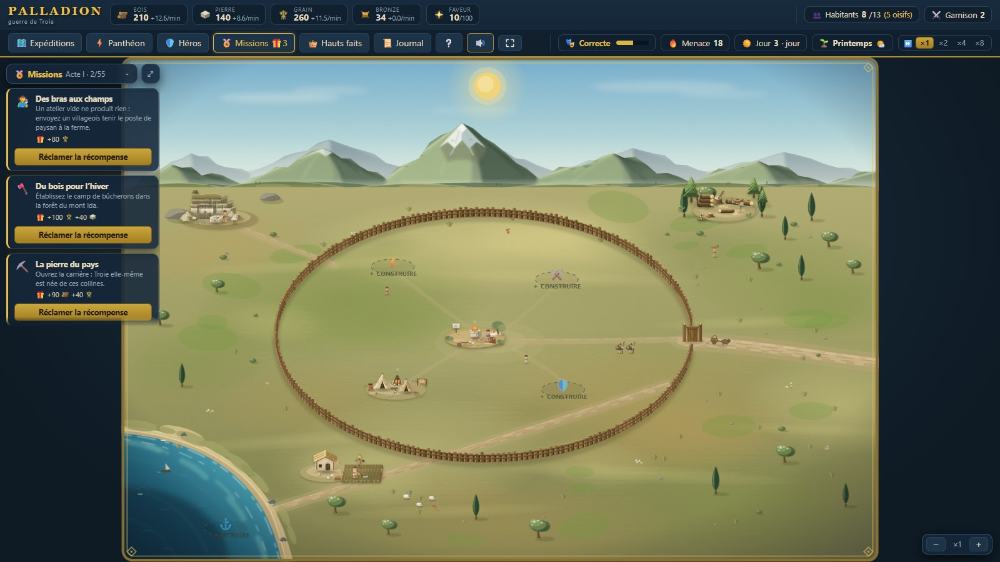 | 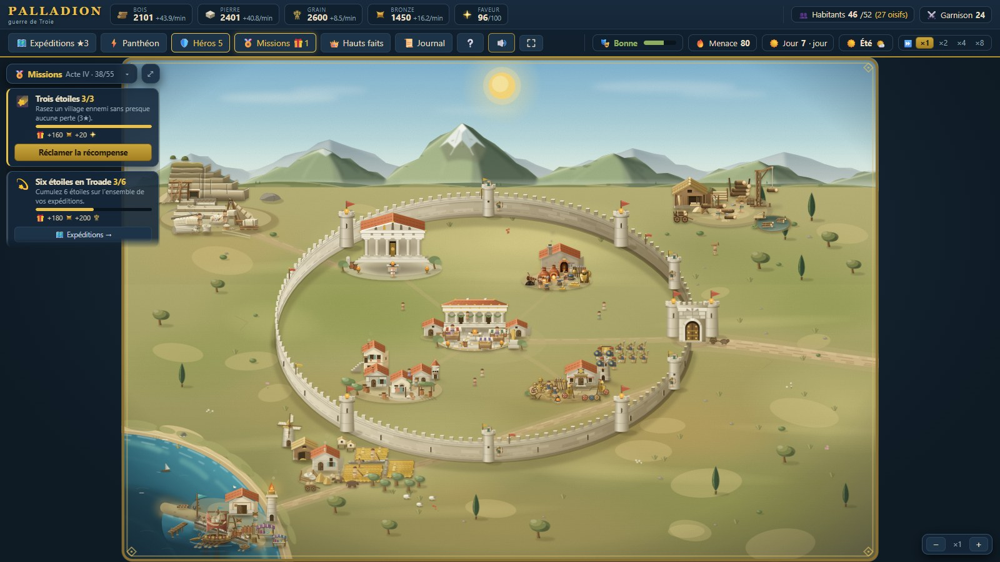 |

## ✨ Ce qui rend PALLADION différent

### 🐴 « La Chute » — une campagne en cinq actes
Au premier lancement, on choisit : **bac à sable** (bâtir sans fin, cinquante-cinq missions,
abdication au moment voulu) ou **campagne**. La campagne suit l'Iliade — les mille nefs, la
colère d'Achille, sous les murs, le fleuve, le cheval — mais d'un point de vue qui n'est pas
celui de l'épopée : **vous n'êtes pas Troie**. Vous tenez un village de la Troade sur la route
des armées, et la grande guerre vous écrase par accident.

Chaque acte **impose une situation héritée** plutôt qu'un départ à zéro : les bâtiments debout,
la garnison, la saison, le ciel, les relations divines — et jusqu'à un pan de mur déjà à terre à
l'acte IV, qui s'ouvre donc sur un siège en cours. Les objectifs ne demandent pas des totaux mais
**une manière de tenir** : « trois assauts sans qu'un seul pan cède », « un assaut sans perdre un
homme », « la quatrième tour avant la nuit du sac ». Chacun peut se perdre, et l'on reprend l'acte,
pas la campagne. Certains héros s'imposent à vous sans rançon parce que le récit les amène : Hector
à l'acte III, Achille au IV, Énée et Cassandre dans les cendres du V.

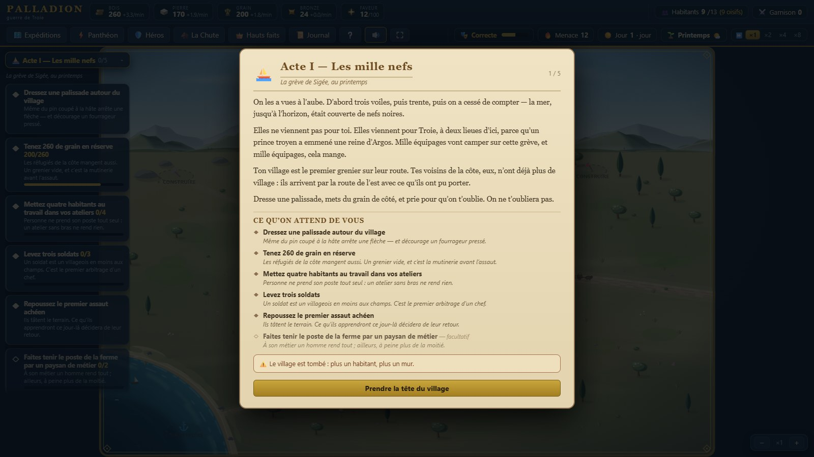

### ⚡ Zeus vous prend par la main
La première partie ne commence pas par un pavé d'aide : le maître de l'Olympe
descend et fait la leçon lui-même, en quinze étapes. À chaque fois, tout
l'écran s'éteint **sauf ce qu'il faut toucher** — et il ne suffit pas de cliquer
« suivant » : les étapes qui comptent exigent le geste. Bâtir la ferme, y placer
un paysan, dresser l'enceinte, ouvrir le temple. On ne peut ni se perdre, ni
survoler.

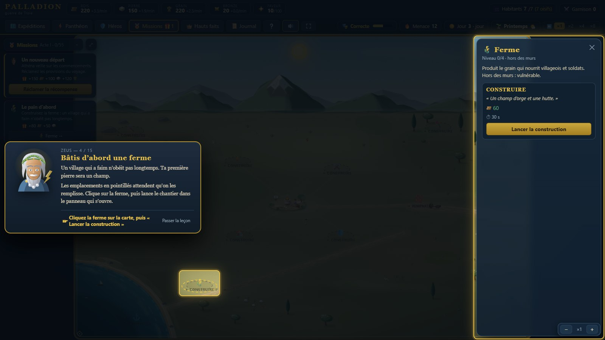

### 🧱 Une évolution **visuelle** des bâtiments
Chaque bâtiment est dessiné **en SVG par code**, en volumes texturés (tuiles, pierre,
chaume, sillons) avec une apparence distincte par niveau. Les remparts passent de la
palissade de pieux → au muret de pierre sèche → à la muraille crénelée → aux hautes
murailles « bâties par Poséidon » avec tours de guet et étendards. Idem pour les 9 autres
domaines (temple, agora, forge, port…). Les dégâts se voient et **restent** : fissures,
pans effondrés, vantaux arrachés — jusqu'à ce que vous payiez la pierre pour les relever.
Et le village **vit** : villageois qui flânent, char à bœufs sur la route, chèvres à la
ferme, moutons au pré, fumées et braseros.

### 🌱 Quatre saisons et un ciel qui change tout
Le calendrier tourne : quatre journées de jeu par saison. Le **printemps** fait lever les
blés, l'**été** durcit la terre et ouvre la mer, l'**automne** remplit les greniers,
l'**hiver ferme la mer** — port au tiers, places d'outre-mer hors d'atteinte. Par-dessus,
une météo qui se retire toutes les quatre minutes : la **pluie** détend les cordes d'arc,
la **brume** rogne la portée des tours et aveugle vos éclaireurs, l'**orage** rend la
foudre de Zeus plus lourde, la **neige** met les colonnes au pas. Rien de tout cela n'est
qu'un chiffre : le feuillage roussit puis tombe, les congères s'installent, les flocons
tombent sur la scène.

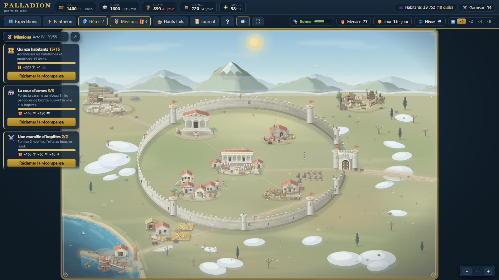

### ⚔️ Des vagues d'assaut PvE, jouées sous vos yeux
La prospérité attire les convoitises : des bandes armées (pillards, guerriers achéens,
mercenaires, béliers de siège) attaquent régulièrement. **« Attaque ennemie dans 5 min »** :
les éclaireurs annoncent la composition de la vague **et la récompense promise** si vous
tenez. Les impatients peuvent **lancer l'assaut immédiatement pour +25 % de butin**. La
vague se scinde ensuite entre **plusieurs fronts** : chaque pan de mur a ses propres points
de structure et **peut céder seul**. La caméra se rapproche du front le plus menacé et le
suit, jusqu'à ce que vous repreniez la main à la molette.

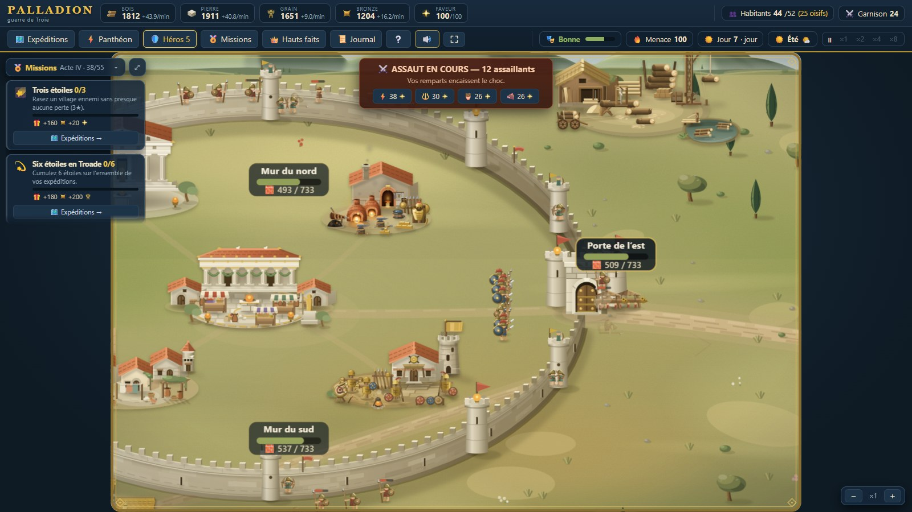

### 👷 Chaque habitant a un métier, et vous le placez vous-même
Un villageois naît paysan, bûcheron, tailleur de pierre, forgeron, prêtre ou docker.
**À son métier il rend pleinement ; ailleurs, 55 %.** Et surtout : personne ne prend
son poste tout seul — pas d'affectation automatique, c'est votre décision à chaque
chantier livré. Un atelier laissé vide plante un écriteau rouge sur la carte, pour
qu'on n'ait pas à ouvrir un panneau pour s'en apercevoir.

Les **sept premiers habitants couvrent un métier de chaque** (avec un second paysan :
la ferme ouvre deux postes avant les autres), et chaque naissance comble ensuite le
métier le plus en retard. Le tirage purement aléatoire donnait des hameaux à quatre
paysans sans un seul prêtre — donc sans faveur, sans recours, et sans que le joueur
puisse rien y faire.

Le même arbitrage vaut pour l'armée : **un soldat est un villageois en moins** — il
quitte l'atelier, ne produit plus et mange le double.

### 🛡️ Huit héros — qu'on nourrit, qu'on perd
Ils ne s'achètent pas : ils viennent quand la cité en est digne. Hector veut des remparts
de niveau 3 et Zeus en grâce ; Ulysse un port et la confiance d'Athéna ; Achille du sang
déjà versé. Chacun apporte un **passif permanent** et une **capacité** à invoquer en
bataille, gagne des niveaux en combattant — et **mange chaque minute**. Trois rappels
d'entretien sans réponse, et il reprend la route.

Ce sont de vrais habitants : on les voit **arpenter la place du village**, chacun à ses
couleurs et sous son nom, et ils **descendent se battre** au premier rang de vos lignes.
Un héros mis à terre dans la mêlée n'est pas rayé de l'effectif — il est blessé, et sa
capacité reste indisponible le temps qu'il se relève. Seul son arc peut le tuer.

Surtout, chacun traverse un **arc à embranchements** dont certaines branches ne se
rejouent pas : Achille peut mourir sous la flèche de Pâris, ou survivre inutile ; Hector
peut sortir affronter son destin, ou obéir et ne plus jamais grandir. **Les héros doivent
pouvoir mourir** — c'est ce qui rend leur présence tendue plutôt que confortable.

| La maisonnée héroïque | Un choix sans retour |
| --- | --- |
| 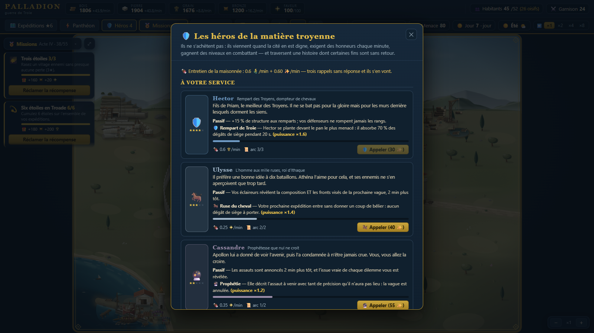 | 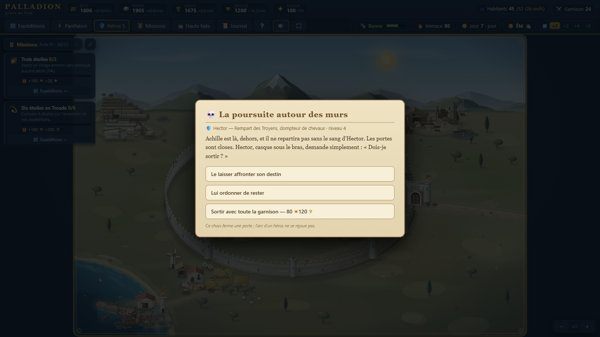 |

### 🗺️ Piller… ou secourir
8 places fortes de la Troade, chacune avec son **décor peint** et son cadre — camp de
tentes dans la plaine, comptoir à amphores sur la grève, cité à colonnade sur son île,
forteresse à donjon sur son éperon rocheux. Deux façons d'y marcher :

- **Piller** — butin élevé, mais Zeus Xenios n'aime pas cela, la menace monte, et le
  village **s'en souvient** : sa garnison sera plus fournie à votre prochaine visite.
- **Secourir** — quand un village assiégé appelle à l'aide, vous avez quelques minutes
  pour trancher. Aucun butin, la possibilité d'y perdre des hommes pour rien — mais la
  faveur des dieux et une **alliance** : tribut régulier, et des renforts qui montent sur
  vos remparts (et tombent avant vos hommes) à chaque assaut.

Le choix est cornélien à dessein : la richesse contre le réseau.

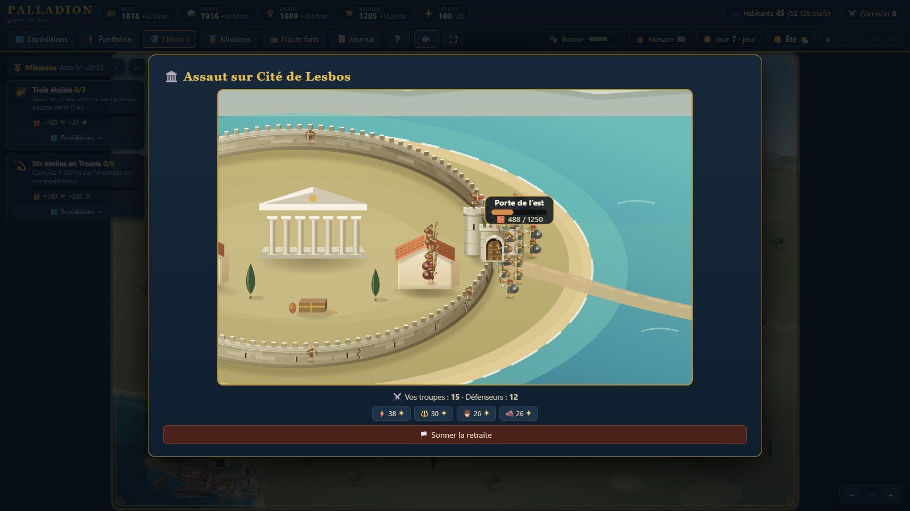

### ⚡ Les Olympiens, alliés et juges — et ça se voit
- **Zeus** — la foudre s'abat sur les assaillants ; sa loi de l'hospitalité (*xenia*)
  punit qui ferme sa porte aux suppliants.
- **Poséidon** — ressoude les pierres de vos remparts, y compris les pans déjà à terre.
- **Athéna** — égide en bataille ; si elle vous fait confiance (relation ≥ 25),
  **elle murmure la vérité cachée des dilemmes**.
- **Arès** — fureur au combat, recrues accélérées ; capricieux et vindicatif.

La **ferveur** (−100 à +100) ne change pas que les chiffres : elle change la **mise en
scène**. L'élu de Zeus voit un éclair pourpre fendre le ciel ; celui d'Athéna, une égide
à tête de Gorgone tournoyante ; celui d'Arès, une aura sanglante et des corbeaux. Et un
dieu **offensé** produit un visuel **pâle et avorté** — l'éclair n'atteint même pas le
sol. La punition se voit avant de se compter.

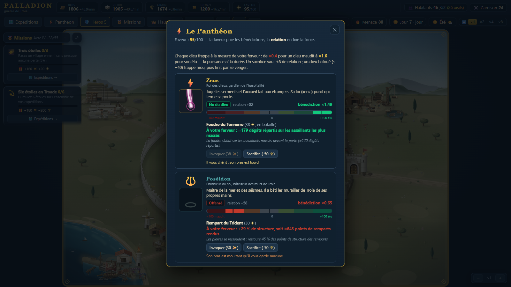

### 🏺 Des dilemmes moraux à conséquences
41 dilemmes à **issues multiples**, tirées à l'ouverture : des réfugiés qui implorent
l'asile (sincères… ou pillards infiltrés), Zeus déguisé en mendiant, un cheval de bois
abandonné devant vos portes (*« Je crains les Grecs, même porteurs de présents ! »*),
l'émissaire d'Hector qui réclame des lances… Certaines issues sont **différées** : les
traîtres frappent à la nuit tombée. Le murmure d'Athéna lit l'issue **déjà tirée** : il
ne peut structurellement pas mentir.


### 🏅 Hauts faits, prestige et fin de règne
45 hauts faits en cinq catégories jalonnent la partie — « tenir un assaut sur trois fronts
sans perdre un homme », « élu des quatre Olympiens », « trois étoiles sur les huit places
fortes », « traverser un hiver sans vider le grenier ». Ils alimentent un **score de
prestige** détaillé ligne à ligne. Quand vous jugez le règne accompli, **abdiquez** : le
score se fige et les aèdes vous donnent un titre, de « Roi de pacotille » à
« Égal des dieux ».

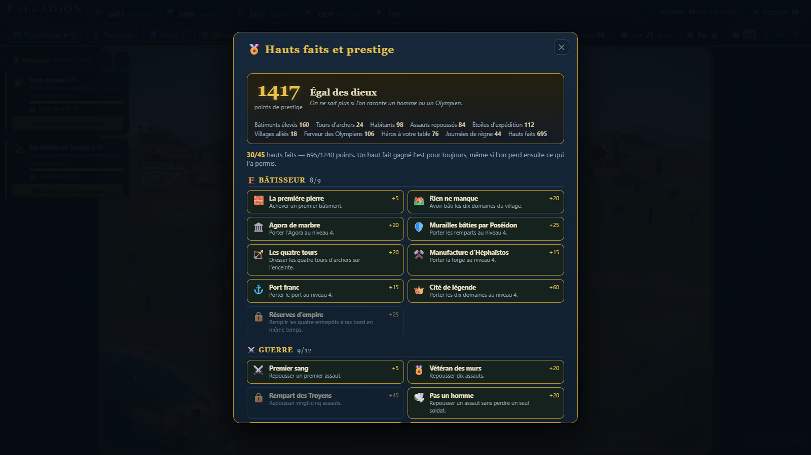

### 🎖️ Cinquante-cinq missions comme fil rouge
Toujours un objectif à l'écran, toujours une récompense à la clé : des provisions du
premier jour jusqu'au Palladion lui-même, les missions guident la partie en cinq actes —
bâtir, pourvoir les postes, repousser un assaut, réussir un raid trois étoiles, gagner la
confiance d'un dieu… Chaque réclamation finance l'étape suivante : pas de temps mort.

Et elles ne sont pas une liste posée à côté du jeu : **chaque mission a un bouton qui
ouvre l'écran où elle se joue** (« 👥 Recensement », « 🏛️ Agora », « 🗺️ Expéditions »…),
le bandeau du haut porte le fil complet acte par acte, et une récompense réclamée laisse
une ligne au journal du village comme une bataille. Trois missions sont ouvertes à la fois,
**jamais au-delà de l'acte en cours** : il faut achever un acte pour que le suivant se descelle.

| Le suivi, toujours à l'écran | Le fil complet, cinq actes |
| --- | --- |
| 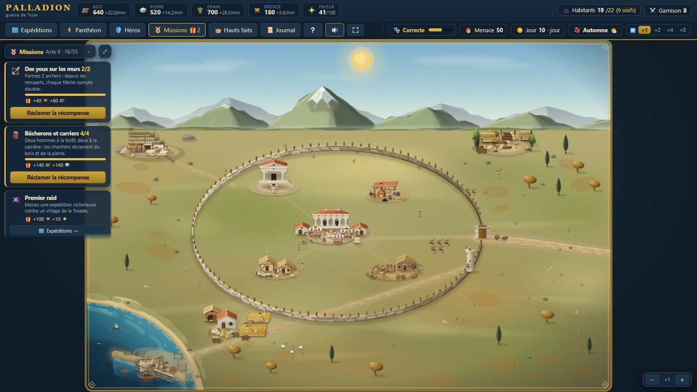 | 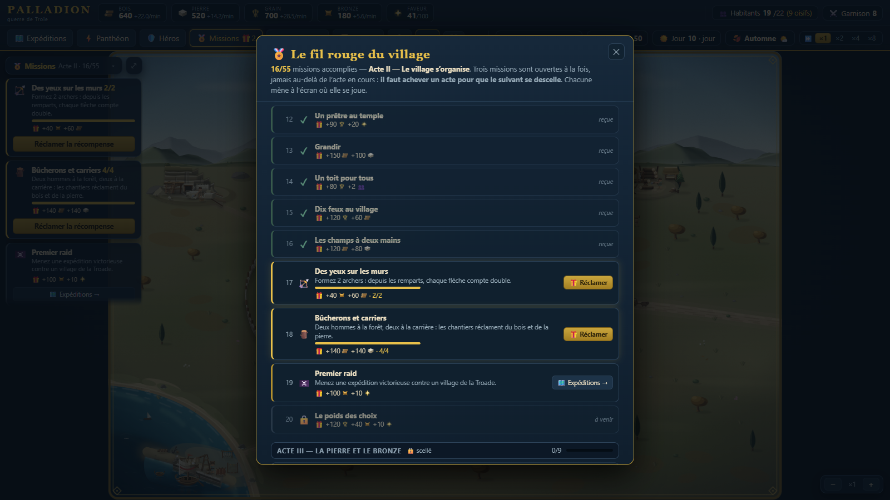 |

### 🎭 L'ambiance du village
Fêtes, victoires et greniers pleins **exaltent** le village (production accrue). Famine,
défaites et choix cruels le rendent **morose**. Sous 25 : **mutinerie** — ouvrez les
greniers, promettez (et tenez parole !), ou réprimez dans le sang. À 0, vos soldats
désertent. L'ambiance tient en un mot, toujours lisible dans le bandeau du haut.

### 🎵 Une bande-son entièrement synthétisée
Pas un octet d'audio téléchargé : tout est fabriqué à la volée en **Web Audio**. Au village,
une flûte de berger égrène une **pentatonique majeure** (aucun demi-ton : il est musicalement
impossible d'y sonner inquiétant) au-dessus d'un bourdon qui ne s'interrompt jamais, avec une
figure de lyre par phrase. **Une note toutes les deux secondes et demie, pas davantage** : le
défaut d'une musique fatigante n'est ni son mode ni son volume mais son nombre d'attaques, et
celle-ci en compte vingt-quatre à la minute là où la version précédente en comptait cent
soixante. Les cors de guerre montent à l'alerte, le tambour de siège prend le relais quand la
colonne touche les murs, et le chant de l'aède salue la victoire. Coupe-son et deux curseurs
persistés — et rien ne joue avant votre premier geste.

### 🌙 Le temps continue sans vous — et vous menez la caméra
Jeu en temps réel avec cycle jour/nuit. Onglet fermé, le village vit : production,
constructions, croissance… et assauts nocturnes, résolus automatiquement. Au retour, un
rapport raconte tout. Façon **Sims**, les boutons **×1 ×2 ×4 ×8** (touches 1–4) accélèrent
tout, avec retour automatique en ×1 pendant les batailles. Et la carte se manipule :
**molette** pour zoomer là où pointe le curseur, **glisser** pour se déplacer,
**double-clic** pour rendre la main à la caméra automatique.

Le bandeau du haut se lit en **deux rangs** : ce que le village *possède* (réserves, faveur,
habitants, garnison), puis ce qui lui *arrive* (ambiance, menace, jour, ciel, vitesse du temps).
Chaque jeton ouvre au survol un **encart chiffré** qui dit à quoi il sert, ce qu'il vaut et ce
qui le fait bouger. Et tout menu se referme de trois façons : sa **croix**, la touche **Échap**,
ou un clic à côté.

## 🎮 Systèmes de jeu

- **4 ressources** (bois, pierre, grain, bronze) + faveur divine + population nommée
- **10 bâtiments** à 4 niveaux, chacun avec son art SVG par niveau ; l'Agora gouverne le
  niveau maximal des autres, 2 chantiers simultanés maximum
- **Métiers et postes** : chaque habitant naît d'un métier, rend 55 % ailleurs, et
  n'est jamais affecté automatiquement — un atelier vide ne produit rien et le dit ;
  la fournée de départ couvre les six métiers
- **Comptoir du port** : échange **à la valeur** (le bronze vaut quatre charretées de
  bois), marge des marchands de +70 % au petit quai à +15 % au port franc
- **3 unités** (lancier, archer, hoplite) — les archers tirent depuis les remparts tant que
  leur pan de muraille tient
- **Assauts multi-fronts** : jusqu'à 3 secteurs assaillis, chacun avec ses points de
  structure et sa propre brèche
- **8 héros** avec passif, capacité active, niveaux 1→5, entretien et arc narratif mortel —
  visibles sur la carte du village et combattants au premier rang
- **Tutoriel scénarisé** en 15 étapes à focus verrouillé, rejouable depuis l'aide
- **Campagne** : 8 villages à piller ou à secourir, étoiles, butin dégressif, garnisons qui
  se renforcent, alliances à tribut — le moteur de bataille est le même en attaque et en défense
- **4 saisons × 6 météos** pesant sur la récolte, la portée, l'allure et l'alerte
- **Deux modes** : bac à sable sans fin, ou **campagne « La Chute »** en 5 actes à objectifs
  imposés, situation héritée et héros scriptés — un acte perdu se reprend, la campagne non
- **41 dilemmes** à issues multiples, **55 missions** en 5 actes verrouillés, **45 hauts faits**
- **165 tests** Vitest sur les règles : comptoir, combat, production, hors-ligne, hauts faits,
  missions, héros, saisons (`npm test`)
- **Menace** croissante, vagues générées par budget, déroute ennemie à 70 % de pertes
- Sauvegarde automatique en `localStorage` (aucun serveur, aucun compte)

## 🛠️ Stack

- [Vite](https://vitejs.dev) + [React 18](https://react.dev) + TypeScript (strict)
- [zustand](https://github.com/pmndrs/zustand) + immer pour l'état du jeu (tick à 4 Hz)
- Rendu 100 % **SVG dessiné par code** — zéro asset externe, zéro dépendance graphique
- Son 100 % **synthétisé en Web Audio** — zéro échantillon
- Aucun backend : jouable en statique, sauvegarde locale

Le style graphique (lumière au nord-ouest, ombres portées vers le sud-est, aucun contour
noir, tirages déterministes) est documenté dans [`docs/STYLE-ART.md`](docs/STYLE-ART.md).
La feuille de route et la dette connue vivent dans [`docs/ROADMAP.md`](docs/ROADMAP.md).

## 🚀 Développement

```bash
npm install
npm run dev       # http://localhost:5173
npm run dev:test  # 🧪 mode test : ressources illimitées, chantiers/recrues instantanés,
                  #    bouton « Attaque » pour déclencher un assaut à la demande
npm run build     # production dans dist/ (châssis, art et récit en trois morceaux)
npm run preview   # tester le build
npm test          # 165 tests Vitest sur les règles du jeu
```

### 📸 Regénérer les captures du README

Les images de ce fichier sont **reproductibles** : chaque vignette pose un état de jeu
précis (saison, bâtiments, héros, panneau ouvert…) avant de photographier l'écran.

```bash
npm run dev -- --port 5199 --strictPort   # dans un terminal
npm run captures                          # dans un autre
```

Le script utilise le Chrome (ou l'Edge) déjà installé sur la machine — pas de navigateur
à télécharger. Il échoue si la moindre erreur JavaScript survient pendant les captures :
c'est aussi le test de fumée du projet.

## 🌐 Déploiement sur GitHub Pages

1. Créer un repo GitHub et pousser ce projet sur `main`.
2. Dans **Settings → Pages**, choisir **Source : GitHub Actions**.
3. C'est tout — le workflow [`.github/workflows/deploy.yml`](.github/workflows/deploy.yml)
   build et déploie à chaque push. (`base: './'` dans Vite rend le build compatible avec
   n'importe quel nom de repo.)

## 🗺️ Pistes d'évolution

- **Cartes propres à chaque acte** de la campagne : les cinq cadres (grève, plaine, murailles,
  fleuve, ruines) sont nommés dans le code et n'attendent que leur terrain peint
- **Siège sans fin** : vagues de difficulté croissante, score et classement local
- **Nouvelle Partie +** : rejouer en gardant le prestige du règne précédent
- **Formations et ordres** en bataille, nouvelles unités (frondeur, char, machines de siège)
- **Héros ennemis nommés** : Achille assiégeant *votre* village, capacités retournées contre vous
- **Familles et lignées** : les villageois se marient, vieillissent, transmettent leur métier
- **Tests de rendu** : les 165 tests couvrent les règles, pas les composants
- i18n (structure des textes déjà centralisée)

---

*Projet personnel — codé avec amour pour la mythologie grecque.* 🏺
